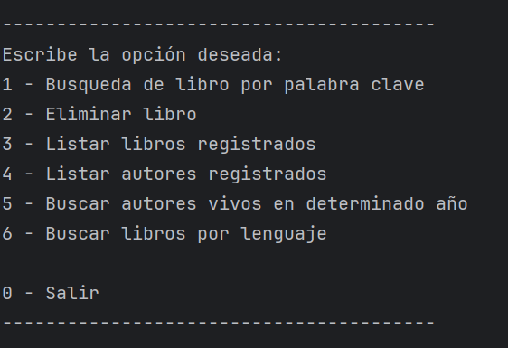

  

<h1 align="center">Challenge - Literalura</h1>

## Objetivo del proyecto propuesto

**Literalura** es una aplicación de consola para gestionar datos de libros. El objetivo es crear una herramienta que permita crear una base de datos personal para consultar información sobre libros y autores, misma que se extrae de una API externa y almacenamos en una base local para un análisis posterior.

Este proyecto fue desarrollado como parte de la ruta de aprendizaje del programa Alura - Oracle Next Education, con el fin de consolidar ocnocimientos relacionados a los estudios de Java y Spring Boot, donde aplicamos conceptos de:
- Consumode APIs REST(Gutendex).
- Mapeo de datos JSON con Jackson.
- Persistencia de datos con Spring Data JPA y PostgreSQL.
- Consultas personalizadas mediante JPQL.

## Estado del proyecto (Badge)
## Características y funcionalidades
1. ***Busqueda de libro por palabra clave:*** Extraemos la información mediante una requisición a la API de Gutendex y los almacenamos en la base de datos si no existe.
2. ***Eliminar libro:*** Evalua si existen datos en nuestra DB y en caso de que sea así, enlista los libros encontrados imprimiendo su información de forma lineal, junto con su id interno, para su observación sea mas simple. De esta manera solo basta escribir el id del libro para ejecutar, o un "0" para cancelar la operación.
3. ***Listar libros registrados:*** Imprime la información de todos los libros registrados en un formato de bloque.
4. ***Listar autores registrados:*** Permite visualizar todos los autores registrados en nuestra DB en formato de bloque.
5. ***Buscar autores vivos en determinado año:*** Muestra un listado de autores que vivieron o viven en un determinado año ingresado por el usuario. 
6. ***Buscar libros por lenguaje:*** Realizando un mapeo de todos los libros, nos arroja un menú considerando unicamente los lenguajes registrados en nuestra DB de donde podemos escoger exactamente el idioma con el que deseamos filtrar nuestros libros almacenados.
## Tecnologías utilizadas
- Java 17: Lenguaje de programación principal.
- Spring Boot 3: Framework para agilizar el desarrollo y la configuración.
- Spring Data JPA: Para el mapeo objeto-relacional (ORM) y gestión de la base de datos.
- PostgreSQL: Sistema de gestión de bases de datos relaccionales.
- Maven: Herramienta de gestión de dependencias y construcción del proyecto.
- Jackson: Librería para el procesamiento y mapeo de datos JSON.
- Gutendex API: API externa utilizada para obtener la información de los libros.
## Requisitos previos
Antes de comenzar, asegúrate de tener instalado en tu máquina local:
- JDK 17 o superior.
- Maven 3.6 o superior.
- PostgreSQL (servicio activo y base de datos creada).
- Un IDE (Recomndado: IntelliJ IDEA).
## Configuración de variables de entorno
Para el cuidado de información sensible y que la aplicación corra sin problemas, configura las siguientes variables de entorno en tu sistema o IDE: `DB_HOST`, `DB_NAME`, `DB_USER` y `DB_PASSWORD`

Tip para IntelliJ: Configura estas variables yendo a `Run`->`Edit Configurations`->`Environment variables`
Nota: Asegúrate de crear la base de datos en PostgreSQL con el nombre que definas en `DB_HOST` antes de iniciar la aplicación.
## Instalación y ejecución
1. Clona el repositorio: `git clone https://github.com/Luisleonla/challenge-literalura.git`
2. Navega al directorio del proyecto: `cd literalura`
3. Construye el proyecto con Maven: Ejecuta el siguiente comando para limpiar y descargar las dependencias necesarias:  `mvn clean install`
4. Ejecuta: Puedes iniciar la aplicación ejecutando la clase `LiteraluraApplication` desde tu IDE o usando el siguiente comando en la terminal: `mvn spring-boot:run`

## Estructura de la Base de Datos
El diseño de la base de datos utiliza una estructura relacional para gestionar la complejidad de los datos de la API Gutendex, manejando autores y múltiples idiomas de forma eficiente.

#### Descripción de las tablas:
`LIBRO`: Almacena la información principal de cada obra.

`AUTOR`: Contiene los datos biográficos de los escritores, evitando duplicidad si un autor tiene varios libros.

`LIBROS_AUTORES`: Tabla intermedia generada por la relación @ManyToMany. Permite que un libro tenga varios autores (ej. antologías) y que un autor aparezca en varios libros.

`LIBRO_LENGUAJES`: Tabla de colección de elementos (@ElementCollection). Aquí es donde se guardan los códigos de idioma (es, en, etc.) vinculados a cada libro, permitiendo la búsqueda por idioma que implementamos con MEMBER OF.

## Desarrollador

 <strong>Luis Antonio Artiaga León</strong>

Desarrollador Java / Backend 

## Licencia
Este proyecto está bajo la Licencia MIT. Puedes usarlo, modificarlo y distribuirlo libremente.